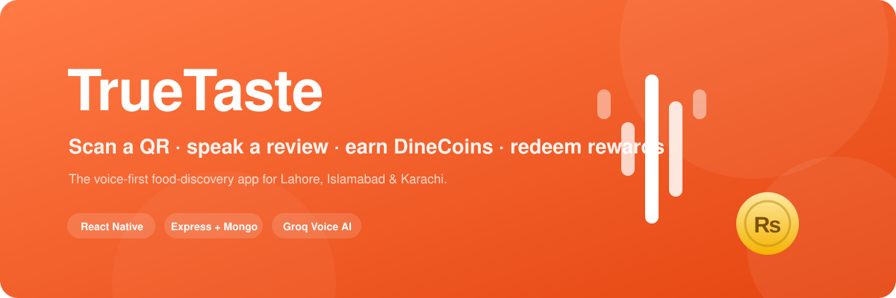

<div align="center">



**Scan a QR · speak a review · earn DineCoins · redeem rewards — the voice-first food-discovery app for Lahore, Islamabad & Karachi.**

</div>

<p align="center">
  <a href="#features">Features</a> ·
  <a href="#how-it-works">How it works</a> ·
  <a href="#tech-stack">Stack</a> ·
  <a href="#getting-started">Getting started</a> ·
  <a href="#qr-demo">QR demo</a> ·
  <a href="#screenshots">Screenshots</a> ·
  <a href="#project-structure">Structure</a> ·
  <a href="#roadmap">Roadmap</a>
</p>

<p align="center">
  
  
  
  
  
  
  
  
  
</p>

---

## Try it now

- **Android APK** (SDK 21+, ~90 MB): [TrueTaste-preview.apk](https://github.com/hackathonteam360/TrueTaste/releases/tag/v1.0.0) — install, sign in as `demo@truetaste.app` / `demo123`, and demo the full flow.
- **Live API**: `https://truetaste-api.bonto.run/api` — every endpoint is hit-testable.

---

## Features

- **Real area data** — 20 authentic Pakistani restaurants across Lahore, Islamabad and Karachi, with menus, photos, opening hours, tables and per-table deep-link QR codes.
- **Voice-first reviews** — hold-to-talk, your words are transcribed (Groq Whisper-large-v3), tagged and sentiment-scored, and each first review of a restaurant earns **10 DineCoins**.
- **DineCoins economy** — welcome bonus, earn-per-review, a coin-activity feed, and a rewards shop (free delivery, coupons, discounts, desserts) — with a once-per-restaurant coin rule shown plainly in the review UI.
- **Discover & filter** — keyword search across restaurants *and* dishes, chips for cuisine / rating / price / open-now, distance sorting, and an Explore map mode.
- **Tailored recommendations** — your city, cuisines, dishes, spice and budget preferences drive a personalized feed.
- **Nearby mode** — GPS-based discovery with a graceful city-centre fallback when location is off.
- **Live navigation** — every restaurant card opens one-tap directions in Google Maps.
- **QR demo kit** — a self-contained page rendering live, DB-driven QR cards for believable table-lookup demos.

## How it works

```
 Scan QR on the table   →  Speak your review    →  AI analysis          →  Rewards
 ┌───────────────────┐    ┌──────────────────┐    ┌─────────────────┐    ┌────────────┐
 │ app resolves the  │    │ transcribed via  │    │ sentiment,      │    │ +10 coins  │
 │ table + menu page │ →  │ Groq Whisper     │ →  │ tags, summary   │ →  │ feed + shop│
 └───────────────────┘    └──────────────────┘    └─────────────────┘    └────────────┘
```

## Tech stack

| Layer | Stack |
|-------|-------|
| Mobile | React Native 0.81 · Expo SDK 54 · Expo Router · Zustand · TanStack Query · Expo Location/Haptics/AV |
| Backend | Node.js · Express · TypeScript · Mongoose · Multer · Cloudinary |
| Data | MongoDB (seeded demo dataset) |
| AI | Groq Whisper-large-v3 (voice), LLM sentiment/summaries with deterministic mock fallback |
| Design | Stitch MCP design-system tokens driving the full visual theme |

## Getting started

```
server/.env    MONGODB_URI, JWT_SECRET, STT_API_KEY (Groq), optional AI_API_KEY
mobile/.env    EXPO_PUBLIC_API_URL=http://<lan-ip>:5000/api
```

```bash
# 1 — API
cd server
npm install && npm run seed && npm run dev      # http://localhost:5000

# 2 — App (separate terminal)
cd mobile
npm install && npx expo start                    # scan with Expo Go on same Wi-Fi
```

No transcription key? The app falls back to a deterministic mock — the demo runs with zero paid accounts.

| Role | Email | Password |
|------|-------|----------|
| Demo user | `demo@truetaste.app` | `demo123` |

## QR demo

Open [`.scripts/qr-demo/index.html`](.scripts/qr-demo/index.html) from disk and scan any card with the app — it resolves to the real table page. Cards are generated straight from the database (not hardcoded IDs), so they survive reseeding.

## Screenshots

Live QR cards generated by the demo kit (top-3 per city):

<div align="center">
  
  
  
  
  
  
</div>

## Ops scripts

| Script | Purpose |
|--------|---------|
| `.scripts/run-server.ps1` | Start the API with rolling log |
| `.scripts/run-expo.ps1` | Start the Metro bundler |
| `.scripts/run-tunnel.ps1` | Expose the API over a Cloudflare HTTPS tunnel |
| `.scripts/api-sweep.cjs` | QA sweep of every read endpoint (15/15 green) |

## Project structure

```
├── mobile/      Expo React Native app (expo-router tabs, screens, stores)
├── server/      Express + TypeScript API, Mongoose models, seed script
├── assets/      Repo branding
└── .scripts/    Demo tooling — QR kit, run scripts, QA sweep
```

## Roadmap

- [ ] Voice-powered search ("find biryani in Lahore") using the on-device mic
- [ ] "Why this for you" — LLM explanations on the recommendations feed
- [ ] Restaurant auto-replies under each review
- [ ] Photo → dish tagging via vision model

## Acknowledgements

UI designed and restyled with [Stitch MCP](https://stitch.mcp.so) design-system tooling; built for a hackathon demo.

## License

[MIT](LICENSE)